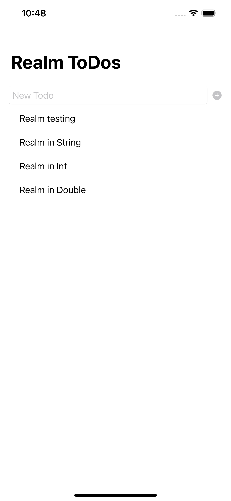
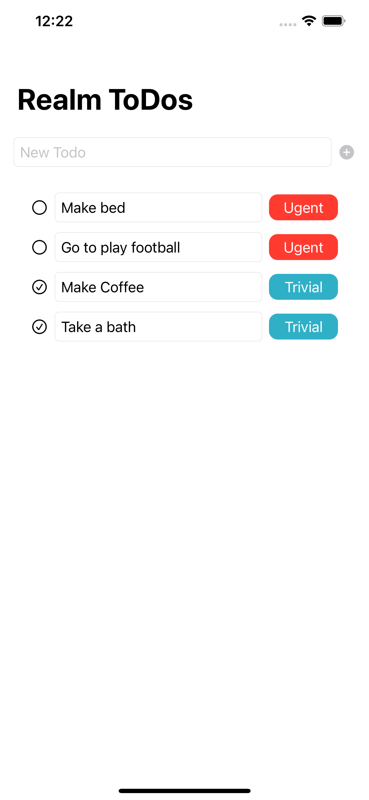
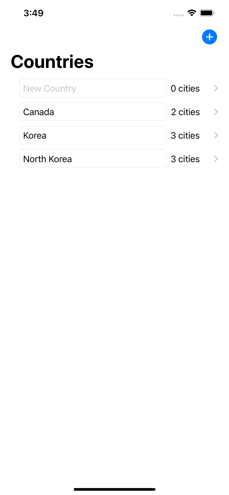
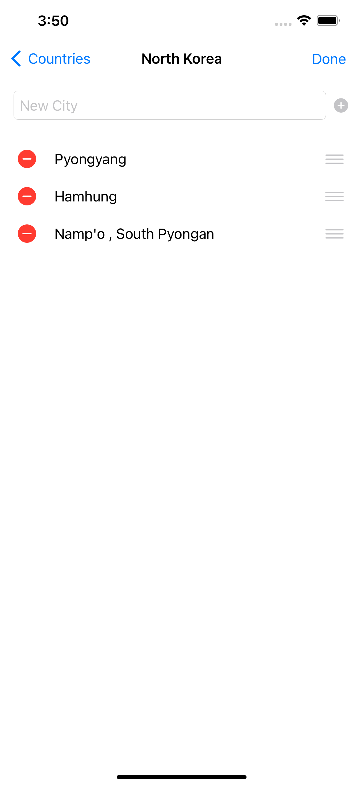
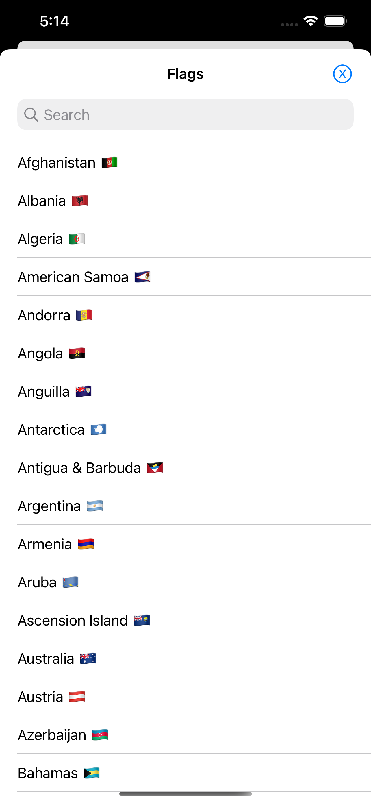
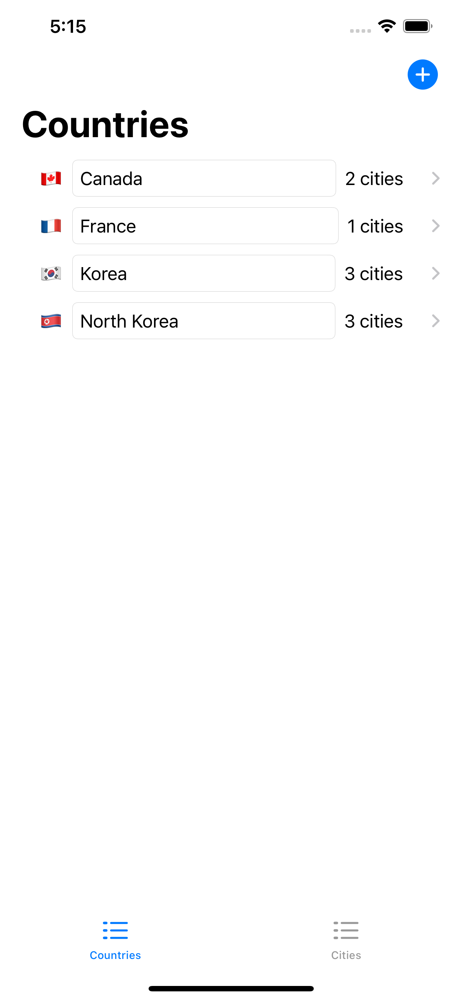

# ToDo-Realm
A simple ToDo's project that using RealmSwift database

## Demo
| Screen 1 | Screen 2 |
| :------------: | :-------------: |
|  |  |
| Screen 3 | Screen 4 |
|  |  |
| Screen 5 | Screen 6 |
|  |  |

## Reference from here
[Here](https://www.youtube.com/watch?v=oK5xoK9QGSQ&list=PLBn01m5Vbs4B8xgS_iEEuJtM_3BuZ7fiV&index=5)
